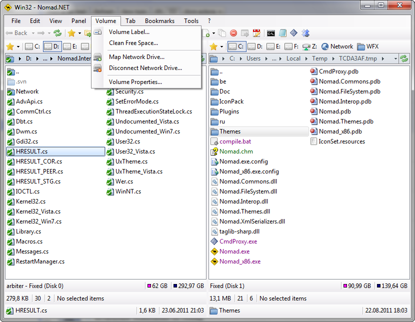

# News

## Version 3.2 Final (3.2.0.2890) is out / <time datetime="2016-06-13">Jun 13, 2016</time>

And here it is. Long awaited final version. Of course "final" is only word in about dialog and in general this release contains minor bugfixes only, but actually it means that release is stable enough to use by anybody. Of course it still contains bugs (some was not found yet, some was not reported yet) but nothing major as I hope. Also this is first final version after 5 years break and this is also some kind of achievement. Congratulations everyone.

As usual detailed history can be found [here][1], and latest version you can grab [here][2]. Also starting from this version final releases will have simplified version numbering.

## Version 3.2.0.2850 rc is out / <time datetime="2016-04-24">Apr 24, 2016</time>

Last step before long awaited final version. Contains updated localizations (many thanks to [translators](about)), various small improvements and bugfixes of course. As usual detailed history can be found [here][1], and latest version you can grab [here][2].

Also with this release I've updated [theme.xsd](theme.xsd) file, you can use this scheme for creating your own Nomad themes.

P.S. Translators wanted! If you want translate Nomad to your language, or to language that you know well - you are welcome. I promise all help you need from my side (and cookies!) while you creating your perfect localization. Localization instructions (with all localizations available at the moment), you can find in [downloads][2].

## Version 3.2.0.2780 beta is out / <time datetime="2016-03-21">Mar 21, 2016</time>

Minor release that fixes most known bugs including most annoying ones. It is also contains updated **CmdPromptTabPlugin** with the following new functionality:

- Commands history
- Auto-suggest commands from history and current directory
- Files substitution code rewritten (now cycle with Tab)
- Improved support for standard actions (Cut, Copy, Paste, etc)
- Right-click console output selection and new context menu with standard actions

As usual detailed history can be found [here][1], and latest version you can grab [here][2].

## Version 3.2.0.2745 beta is out / <time datetime="2015-10-22">Oct 22, 2015</time>

Minor release that fixes most bugs reported since previous version. As usual detailed history can be found [here][1], and latest version you can grab [here][2].

P.S. Localization files updated as well, so if you have desire to translate Nomad into you language or if you want update any existing localisation - feel free to try. If you have any questions regarding localization (or any other questions) contact me directly via mail.

## Version 3.2.0.2730 beta is out / <time datetime="2015-10-07">Oct 7, 2015</time>

After very long break I can finally present the very new Nomad version which is available for download. Despite for a long period of silence Nomad development wasn't stopped all this years, it was not very active however. Latest release contains a lot of new features and fixes many bugs. Some new bugs will be introduced too.

Especially I would like to note updated and extended plugin framework. Documentation for the API is still not ready (I will create it only by demand), so if you have desire to improve Nomad in any way, feel free to contact me directly. In this new version, you'll also find a new plugin - VirusTotalPlugin which, as you can see from its name, allows you to check any suspicious file with the appropriate service. More detailed changes history can be found [here][1] and new version is available for download [here][2].

Starting from this version only Windows XP and later OSes will be supported. This doesn't means that the program will stop working under older Windows versions, most likely it will work as intended, but no tests will be performed under outdated OSes and errors will be fixed only in exceptional cases.

## New localization - Czech / <time datetime="2012-01-11">Jan 11, 2012</time>

I'm happy to announce than Nomad's language family is growing. New member is Czech, all compliments and personal thanks from me goes to **Jakub Vít** for his work. This translation is for stable version too (2.8.7.1740) and you can grab it [here][2].

## New localization - Italian / <time datetime="2012-01-08">Jan 8, 2012</time>

Italian localization just arrived on site. Many thanks to **Claudio Vicari** for made this localization available. This localization intended to use with latest stable version (2.8.7.1740). If you want to use it, simply download it [here][2] and extract archive content to Nomad root folder.
Localization instructions and all available text localization files updated to the actual state, so if you wish to localize Nomad into your language you should download and use updated *nomad-localization.zip* file. Do not forget to read readme.txt first, because it contains some useful localization tips.

## Version 3.0.5.2365 beta is out / <time datetime="2011-12-29">Dec 29, 2011</time>

Happy new year to everybody! As promised I release new version in the year 2011, consider it as my small gift to all you, my fellow users :)
This version contains several improvements, most important is support for custom plug-ins, but there is also improvements in ftp and shell file systems, new and updated featured, and of course, bunch of bug fixes. Also in this release you will find two demo plug-ins written by me, source code for these plug-ins will be published a bit later (first week of January).

Almost all errors reported by you were fixed, so if you are using version 3 you should upgrade. However if you using stable version now, consider upgrade too. New version offer much-much more that latest stable release and it should stable enough.

As usual release history is [here][1], and download new version from [here][2].

## New localization - French / <time datetime="2011-11-03">Nov 3, 2011</time>

New first class localization arrived, this time for French language. Many thanks goes to **Guy Pouliot** for his superb work. This localization intended to use with latest stable version (2.8.7.1740), so if you wish to use it, download it [here][2] and simply extract archive content to Nomad root folder.

Localization files for other languages also updated a bit. These files still apply for stable version only, but update is coming (both for localization files and Nomad itself).

## Version 3.0.0.2135 alpha is out / <time datetime="2011-08-22">Aug 22, 2011</time>

It is here at last! Long awaited version 3.0.x!

You can download it [here][2]. Changes are countless and you can find short description of most (but not all) new features [here](https://groups.google.com/d/msg/nomad-net/8lzFUR6G4zY/KIX_SKwxEokJ), later I will update history.txt with detailed description of what's new in this version.

Also this is alpha, very stable but still alpha, so importing settings from previous version is disabled. Binaries optimization is also disabled by default (however you can compile it if you wish). Full debug information is enabled in this build, so this can slowdown application a bit, especially in comparison with current stable version. However there is a lot of speed optimizations done in this release, so I think , so I think it should faster actually.

## Final version at last (2.8.7.1740) / <time datetime="2011-03-31">Mar 31, 2011</time>

So here it is. After years of Nomad developing I've decided to release first final version. Of course it has some glitches and known issues (minor), but after gathering statistics and reports for all release candidates, I can say that final version has no major bugs or issues (at least known for me, and if I do not know about bug this is your fault :). Well, you know what to do, [grab it in downloads][2] and tell your friends :)

## Nomad needs your help / <time datetime="2011-02-22">Feb 22, 2011</time>

Nomad is not very known on the internet, at least in comparison to direct competitors. And I still receive mails like: "Today is the first day when I hear about Nomad and I like it, thank you.". Without questions Nomad popularity were constantly grow in time, but slowly. And I need you, my fellow users, to improve that. **Please, if you like Nomad, promote it among your friends, write posts, comment and messages about it blogs, post it to the soft catalogs and do any other things to make Nomad more known and popular.**

Second. **Translators needed!** Right now Nomad was translated to 6 languages (3 translations was made by me) and that is not enough. Actually I know about at least 5 started translations (just checked mail archives this is Polish, Italian, French, Spanish and Czech), but seems that people who communicated with me was frozen their efforts (I think so because I did not receive any mails from them for more than 6 months).

Yes I know that translating Nomad can be time consuming task, because in contrast to many others Nomad have many strings to localize, and info-tips translation is also a bit of pain. But in exchange you can create almost flawless interface on your native language (or not native) for Nomad that simply looks first class citizen (this is because all elements in dialogs is auto-sized, so no more truncated string, and support for plural forms adding a polishing to translation). Believe me I've spent a lot of time to achieve this.
**So if you want or think about translating Nomad onto your native language, or even have any ideas or questions, feel free to mail me.**

## Version 2.8.7.1725 RC is out / <time datetime="2011-02-15">Feb 15, 2011</time>

As you can expect from number this version is service release and contains bugfixes only (including annoying rename bug). No critical error found during past months, so I can say that it is almost-almost final. This release is also including both 32 and 64 bit 7z.dll versions.

## New page about extensibility on site / <time datetime="2010-12-02">Dec 2, 2010</time>

New page with description of [Nomad extensibility](plugins) has been added. Right now it contains list of tested TC plugins and small guide how to install them.

## Version 2.8.7.1700 RC is out / <time datetime="2010-11-22">Nov 22, 2010</time>

Do not expect any new features from this version, because this is only service release that fix some reported bugs (for example: broken customize panels in options, missing icons in panels and more). Installation files as usual can be found on [Downloads][2] page, and detailed changes history on [Roadmap](roadmap) page. Upgrade to this version is recommended.

## Version 2.8.7.1685 RC is out / <time datetime="2010-08-30">Aug 30, 2010</time>

After long period of development and testing Release Candidate is finally arrived. Since previous release in July I receive only several bug reports (all these bugs were fixed), so I believe that program is stable enough. Also after processing survey results (I hope to publish them soon) many people think that browsing speed is not fast enough, so this version improves local file system browsing speed by about 15%.

## Version 2.8.7.1672 beta is out / <time datetime="2010-07-20">Jul 20, 2010</time>

Bugfixing release. No new functional added, just fixed couple of bugs reported since previous release. You know where to [find][2] it :)

## After long alpha testing period new version is finally out / <time datetime="2010-06-09">Jun 9, 2010</time>

It is not final release yet, event not RC. But latest beta (2.8.6.1638) is very stable from my point of view at least. All known critical bugs fixed at last, and almost all other known bugs fixed as well. There is enormous amount of new features since last stable release you can read about it in [history][1]. Binaries as usual can be found on [Downloads][2] page.

## First survey / <time datetime="2010-05-14">May 14, 2010</time>

Now when 2.8.6 branch is moving to release, I want to collect your comments and wishes. That is why I have started first Nomad survey (you can find it here). I really like to hear responses from you, and they really important for me to decide what to do next. So if you like Nomad, want it to improve, please participate in this survey.

## New alpha version and groups reminder / <time datetime="2010-03-31">Mar 31, 2010</time>

This week one of **Nomad.NET** users noted me, that new version is out, but he does not see and mention about it in News or anywhere on this site. This post is a reminder about [**Nomad.NET** group][3], where you can find various discussions about nomad features, post bug reports or download latest alpha versions. In general you can consider this groups as official **Nomad.NET** forums.

Also do not forget about "Check for Updates" command in help menu. Using this command you can always check for new version right from nomad.

And last but not least, last stable version is 2.6.8.x, but latest available version (in groups) is 2.8.5.x. This version is alpha, but it contains enormous number of new features, bug fixes, etc. So if you want to check or test it, welcome:  
[Version 2.8.0.1410](https://groups.google.com/group/nomad-net/browse_thread/thread/28c1165a1cde1e4d)  
[Version 2.8.5.1523](https://groups.google.com/group/nomad-net/browse_thread/thread/9f2d5a932dd91f57)

## Ukrainian localization added / <time datetime="2010-03-23">Mar 23, 2010</time>

Now you can download Ukrainian **Nomad.NET** localization. I've been very busy with new Nomad version, so right now this localization available as separate download only. Many thanks for **Igor Kovalenko** for its work!

To install localization simple extract downloaded archive into Nomad folder and select new language in options.

## Happy new 2010 year / <time datetime="2009-12-31">Dec 31, 2009</time>

This year was been very productive for Nomad, many features were implemented, more to come, and even more planned. I have a grandiose plans to make #1 orthodox file manager in the world, and I hope that coming year will be much more productive and interesting. So many wishes for all current (and future) users of **Nomad.NET**, and you can expect a holiday gift in the first week of new year (hint: new version) :)

## Version 2.6.8.1195 RC is out / <time datetime="2009-09-01">Sep 1, 2009</time>

Yet another milestone passed on the road to stable release. This time, in addition to bugfixes, this release implements several user requests. Also there is new Nomad localization - Dutch, many thanks to Martijn Weisbeek. New version, as well as updated nomad-localizaion.zip can be found on the [downloads][2] page.

## Version 2.6.8.1180 RC is out / <time datetime="2009-07-07">Jul 7, 2009</time>

Long awaited RC is out. All changes for 2.6.8 branch is frozen, so this release contains only bug-fixes. Almost all bugs reported from the previous version was fixed. As usually you can grab the program on [downloads][2] page.

*Note*: I mentioned reported errors with sense. If I do not know about existence of particular error, I cannot fix it! All messages like: "Your program is buggy, please fix it before I can start using it", will be ignored. Please, be specific, if you encounter a bug, and when it is not hard to you, send me a mail with description (provide as much details as you can). Believe me this will be good for us all :)

## Version 2.6.8.1166 beta is out / <time datetime="2009-06-08">Jun 8, 2009</time>

This is maintenance release, it contains bugfixes, various localization typos fixes and changes in dialogs layout for better and easier localization, so this version is better suitable for translate. Also this version introduces full German localization (thanks  to Sven Knurr). Files for Nomad localization updated as well. Grab them in the [downloads][2] section.

## New icon pack and localization files update / <time datetime="2009-05-26">May 26, 2009</time>

Just uploaded new icon pack (Gnome) in the [appropriate](iconpack) section. Also I have updated [files for Nomad localization][2] (Removed unnecessary string that can lead to crush in the current Nomad version and some missing values added to English localization).

*Notes to translators*: Due to bug in the program, current Nomad version is sensitive to .lng file validity. So, while this bug is not fixed, translate substitutions with care. And, of course, if you find any problems, feel free to mail me.

## Version 2.6.8.1140 beta is out / <time datetime="2009-05-13">May 13, 2009</time>

New beta release. This time it contains only bugfixes found in the previous version. Also this is public release, so it will be uploaded to various soft-catalogs. As usual you can grab it in [appropriate][2] section.

## Localizators Needed / <time datetime="2009-05-08">May 8, 2009</time>

If you like **Nomad.NET** and do not like interface in English (or simple prefer interface in your language), you can help me, and create localization for your language. With features added in the latest beta you can create simple text file localization and test it in action. I have prepared and uploaded [instructions](downloads/nomad-localization.zip) how to create you own localization, you can find it in [downloads][2] section. I have also added all localizations created by me into this archive, so you can use them as basis for your localization (for example, you can take english localization file and translate it line by line).

Nomad is freeware, so I cannot give you working key or something like that in exchange, but I can (and I will) include your name into thanks section and into nomad itself.

*Note*: If you native English speaker, or if you have strong English skills, you can also help me by reviewing English localization (my English is not perfect, and I think that my localization contains mistakes).

## Version 2.6.8.1115 beta is out / <time datetime="2009-04-24">Apr 24, 2009</time>

New release now stable enough for beta. This release mostly contains usability improvements and user requests implementation (check the [changelog][1], because there is a lot of them). Most important are ability to hide files and folders, improvements in folder customization, setup and upgrade wizard on start, and some others.

This version was posted only in groups right now (you can download it [here](http://groups.google.com/group/nomad-net/browse_thread/thread/135d0f4fb75cd02a)), because new upgrade wizard need some testing. I hope in a week post this version everywhere.

## New Icon Pack / <time datetime="2009-04-19">Apr 19, 2009</time>

[Icon packs](iconpack) page was updated:
- First, I have created and uploaded icon pack based on [VisualPharm](http://visualpharm.com/hadware_icon_set/) free icons. It is relatively small and consist from only 13 icons, but these icons are very professional and good-looking.
- Second, Tango icon pack was updated to 0.8.90 version (some new icons, some new extensions).
- And at last, third, all other icon packs received small updates as well.

## Version 2.6.5.1053 alpha is out / <time datetime="2009-05-23">Mar 23, 2009</time>

New alpha release. This release mostly contains usability improvements and user requests implementation (check the [changelog][1], because there is a lot of them). But there is more, nomad receives major volume framework update, as well as, experimental support for different ftp encodings.

Also with this release **Nomad.NET** achieves two important milestones: firstly, number of repositary commits grows above 1000 mark, and the second, it is about one year passed after first public release (2.0.0), so you can see major improvements in all areas last year, and feel speed of nomad development :)

This release is important for me, and I hope, for all of you. So I decided to post this message not only in [groups area][3] but also here. You can download this alpha in [groups](https://groups.google.com/group/nomad-net/browse_thread/thread/3ec1867ecbb9a3dc).

## Version 2.5.1.880 RC is out / <time datetime="2009-03-02">Mar 2, 2009</time>

Bugfixing only release. In this version several crushes was fixed (related to reparse and mount points), some smaller fixes applied too. I hope that this version does not contains critical bugs, so it can be last release candidate.

## My birthday and new alpha / <time datetime="2009-01-28">Jan 28, 2009</time>
Hello everybody. Today is my birthday, so I decided to present a preview of new release. This is alpha release but I think that it is stable enough for everyday use. This is major upgrade features tabs, portable mode, configurable themes and so on. You can find more about this version (and grab it) in [groups](https://groups.google.com/group/nomad-net/browse_thread/thread/e4e2480eb1efee04).

## Version 2.5.1.868 RC is out / <time datetime="2009-01-20">Jan 20, 2009</time>

This release does not contain any new functionality, instead it contains only bug fixes. Because all known bugs was fixed I have changed version status from beta to release candidate. And almost forget, this version also includes some new menu icons and completely new fancy about dialog logo. Take it in the [downloads][2] section as usual.

P.S. I also want to release stable final version as fast as possible, so from this version forward I have two development branches (alpha and release). So, in the nearest future you can expect new alpha with lot new functionality (tabs, for example) in [groups][3].

## Version 2.5.1.845 beta is out / <time datetime="2008-12-29">Dec 29, 2008</time>

After long period and bunch of internal builds, new version is finally out. There is enormous number of new features, improvements and bugfixes. One of the main highlights of this version is greatly improved archives support framework. Now you can create new archives, update existed and delete files from archives (both 7z formats and wcx-packer plug-ins supported). There so many improvement so I don't see necessity to list them all there, it is better to [download new version][2] and see by yourself. For full changes log you can go [there][1].

## Hosting changed / <time datetime="2008-10-27">Oct 27, 2008</time>

As you can see hosting of this site very first page finally moved to Google Sites (Previously first redirection page was hosted in Google Pages, now everything hosted in Google Sites). Also entire site is now available under nomad-net.info domain, and now you don't need to remember long version of site address (this address is still available, and will be available in future: <https://sites.google.com/a/nomad-net.info/en/>).

P.S. You can also vote for Nomad new features in my blog. Blog is in Russian, but poll in English, so don't be afraid.

## Version 2.3.0.685 RC is out / <time datetime="2008-08-14">Aug 14, 2008</time>

After almost two months waiting new release is out. As you see, this release is marked as release candidate, not beta, this means that program is stable enough to leave beta stage. This release, as always, intended to be bug-fix only release (previous version introduces two critical errors), but with time it grows into something big. So the highlights of this release is improved look: themes, icon packs, various layout changes, advanced tooltips, etc. List of other improvements and bug fixes you can find in changes history. Grab new version on [downloads][2] page.

## Nomad.NET Google Group created / <time datetime="2008-08-24">Jul 24, 2008</time>

I have created [group related to Nomad.NET](http://groups.google.com/group/nomad-net) on google groups. Right now there is no members, no posts, nothing. But in future I will post early betas there for preview. This group can also be used for **Nomad.NET** discussions, feature suggestions, and so on. Everyone invited.

## Viewer and Editor posted / <time datetime="2008-07-23">Jul 23, 2008</time>

Due to some requests. [Editor](old-editor) and [Viewer](old-viewer) is extracted from old nomad installation and placed on [downloads][2] page in separate packages. You can use these programs with **Nomad.NET**, just download files, extract them into nomad folder and setup editor and viewer path in options.

## Version 2.2.5.605 beta is out / <time datetime="2008-06-23">Jun 23, 2008</time>

This version intended to be simple bug fix release. But with time several important new features was added too. Starting from this version code optimization was began, so this version take less time to start, work faster and consume less memory than previous ones. Many, many bugs was fixed too, this release is quite stable, so I recommend upgrade to this version. As always you can take new version from [downloads][2] page.  
*Note*: You must setup application from the beginning, because all settings, except bookmarks was not copied from previous version.

## Version 2.2.0.537 beta is out / <time datetime="2008-05-14">May 14, 2008</time>

New **Nomad.NET** version is out at last. In this version I have changed program versioning, now first number means great changes in program, second means that important feature has been added (Major version), third means that minor feature has been added (Minor version), and last number is number of commits into the repositary (Revision number). When major version number changed, minor version number is cleared, revision number is persistent. With this release I have also publish this site on the web. You can download new version here, version history can be found [here][1].

## New official site / <time datetime="2008-05-08">May 8, 2008</time>

After searching for a good free hosting for **Nomad.NET**, I decided to implement official site using a strange mix of Google Apps, Google Pages and Google Sites. Maybe not perfect solution, but free, fast and easy to update and maintain. Will see for hidden glitches of this decision.

## Nomad.NET blog was created / <time datetime="2008-05-07">May 7, 2008</time>

A blog related to **Nomad.NET** was created. This blog will be mostly related to announcements and program using tips and tricks. You can find it [here](https://nomad-net.blogspot.com/) (russian language only).

[1]: <history.txt> "history.txt"
[2]: <downloads> "downloads"
[3]: <https://groups.google.com/group/nomad-net> "groups"
